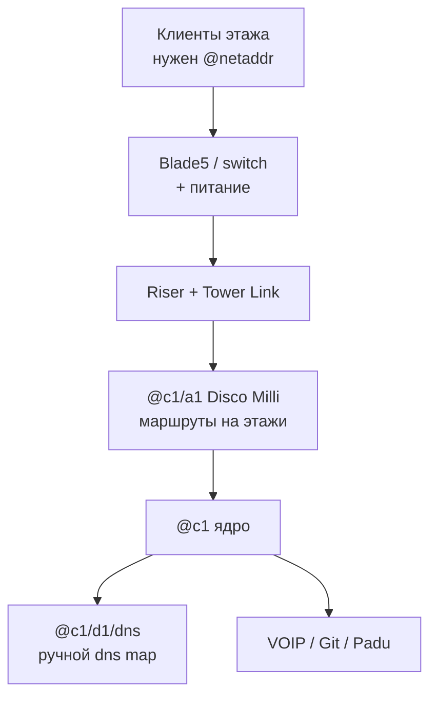
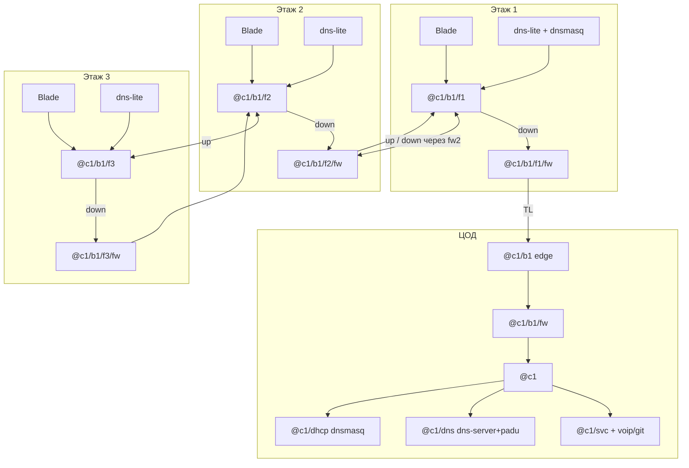
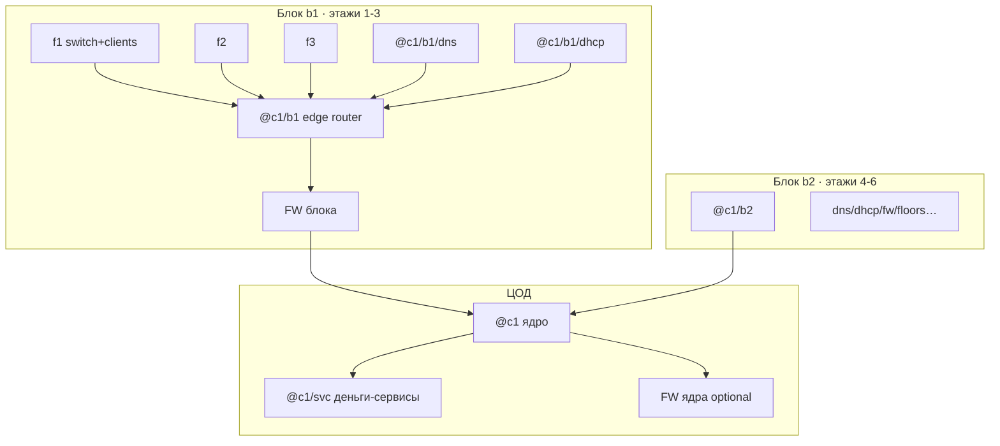
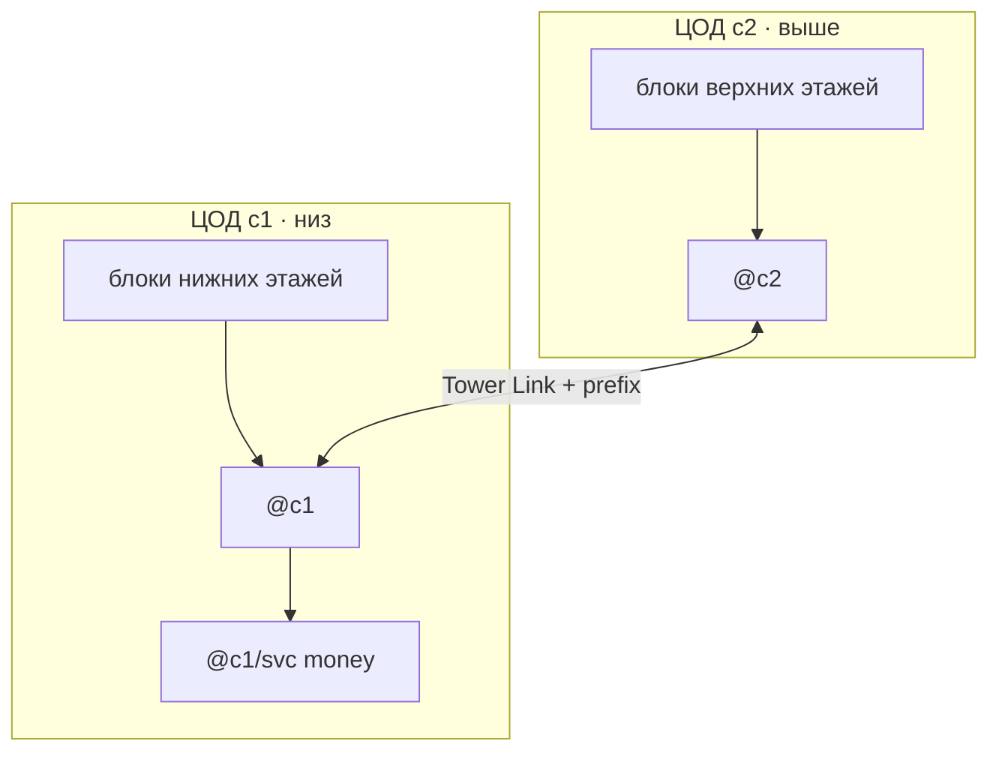
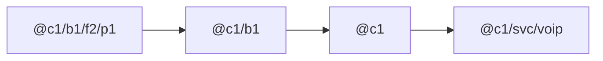

# Основы сети

[← 01 Введение](./01-introduction.md) · [Оглавление](./README.md) · [03 Алиасы](./03-aliases.md)

Анатомия блока, режимы A/B, маршрутизация, DNS/DHCP/FW — «большая картина» перед walkthrough.

---

## Твои настройки (сводка)

| Настройка | У тебя | Что это значит для гайда |
|-----------|--------|---------------------------|
| Свободная игра | Выкл | Обычный прогресс, без «песочницы без правил» |
| Start with all tech | Выкл | Технологии/команды открываются по ходу (cron, sftp и т.д. — не жди их с нуля) |
| Infinite money | Выкл | Считай бюджет; длины кабелей и число роутеров важны |
| Бесплатное электричество | Выкл | Питание этажа и DC стоит денег — не раздувай железо зря |
| Автосоздание DNS-записей | **Выкл** | DNS map делаешь **вручную** в netshell / Registry |
| Подсказки по подключению | Вкл | Можно опираться на подсказки линков в мире |
| Видеть ошибки/подсказки в мире | Вкл | Ошибки маршрутизации/линка видны в мире — смотри их до «магии route» |
| Бесконечная пропускная способность устройств | **Выкл** | Switch ≈ хаб: не сваливай весь этаж на один слабый Blade без нужды |
| Отладчику нужна свободная ПС | Выкл | Debugger проще в использовании по bandwidth |
| Столкновение устройств | Выкл | Расстановка проще |
| Локальные DNS записи | **Вкл** | Локальный DNS работает — после ручного `dns map` |
| Автозапуск установленных программ | **Выкл** | После `program install` программу может понадобиться **запустить вручную** |
| Для запросов нужны сетевые адреса | **Вкл** | Без `@netaddr` запросы клиентов **не пойдут** — `ncall` обязателен |
| Default user/device DHCP | **Выкл** | DHCP сам не раздаёт адреса — либо статика (`ncall`), либо потом поднимаешь DHCP сами |
| DHCP skip routing on source | Выкл | Обычная маршрутизация DHCP-трафика, когда дойдёшь до DHCP |

> **Главный вывод под твой пресет.** Связь этажа = (1) физический Tower Link + (2) **обязательные** net address на клиентах/свитче + (3) маршруты на роутере + (4) **ручные** DNS map. Без п.2 клиенты «немые», даже если кабель и route идеальны.

---

## Большая картина



Этажи без авто-DHCP и без авто-DNS: ты сам даёшь имена, сам прописываешь DNS, сам следишь за перегрузкой линков.

---

---

## Как устроена сеть в двух словах

```text
Клиенты → Blade → этажный роутер
                ↕ вверх/вниз (Tower Link)
Низ блока → ЦОД: edge → FW → ядро → svc → money
                 + корневой DNS (@c1/dns) + DHCP ЦОД (@c1/dhcp)
На f1 блока: DNS блока + DHCP блока (dns → блок, потом @c1/dns)
На f2/f3: свой dns-lite (DHCP с f1)
```

**Блок** = ~3 этажа в **цепочке этажных роутеров**. Сейчас `b1` = этажи 1–3. Этажи 4–6 = `b2` со **своими** DNS/DHCP на своём f1 — не продолжай up с этажа 3.

---

---

## Анатомия блока: цепочка этажных роутеров

### Идея

На **каждом** этаже блока свой роутер:

| Этаж внутри блока | Куда смотрят линки роутера |
|-------------------|----------------------------|
| **Нижний** (f1, ближе к ЦОД) | **Вниз** → в ЦОД (на edge `@c1/b1`) **и вверх** → на роутер следующего этажа |
| **Средний** (f2) | **Вниз** → этаж ниже **и вверх** → этаж выше |
| **Верхний / последний** (f3) | **Только вниз** → на этаж ниже. Вверх **не** ведём (конец блока) |

Клиенты **не** висят напрямую на Tower Link: `клиенты → Blade → этажный роутер → линк вниз/вверх`.

**Серверы DNS/DHCP и защита:**

| Место | DNS | DHCP | FW |
|-------|-----|------|-----|
| **ЦОД** | `@c1/dns` (**dns-server**+padu) | `@c1/dhcp` (**dnsmasq**, prefix `@c1/`) | `@c1/b1/fw` |
| **f1 блока** | `@c1/b1/dns` (**dns-lite**) | `@c1/b1/dhcp` (**dnsmasq**, prefix `@c1/b1/`, dns → блок **и** `@c1/dns`) | `@c1/b1/f1/fw` |
| **f2** | `@c1/b1/f2/dns` (**dns-lite**) | нет | `@c1/b1/f2/fw` |
| **f3** | `@c1/b1/f3/dns` (**dns-lite**) | нет | `@c1/b1/f3/fw` |

Money voip/git — только ЦОД. Клиенты блока: `dhcp option dns @c1/b1/dns @c1/dns` (сначала блок, потом корень).



```text
ЦОД:   @c1/b1 → @c1/b1/fw → @c1 → svc → voip/git
       + @c1/dns (dns-server+padu) + @c1/dhcp (dnsmasq)

Этаж1: Blade → router f1 ← dns-lite + dnsmasq(блок)
                 │ down → f1/fw → TL → ЦОД
                 │ up → этаж 2

Этаж2/3: Blade → router ← dns-lite; down через fN/fw; f3 без up
```

### Зачем роутер на каждом этаже

- Префикс `@c1/b1/fN` остаётся на этаже: меньше broadcast на чужих Blade.
- Цепочка: в ЦОД уходит **один** Tower Link от низа блока, а не три параллельных с каждого этажа.
- Граница блока явная: у f3 нет «вверх» → случайно не склеишь b1 с b2.
- Потом проще VLAN/FW на этаже.

### Комплект ролей

| Роль | Имя | Где физически |
|------|-----|----------------|
| Edge блока | `@c1/b1` | **ЦОД** — сюда «вниз» с этажа 1 |
| **Firewall блока** | `@c1/b1/fw` | **ЦОД**, разрыв edge → ядро |
| Money VOIP/Git | `@c1/svc/voip`, `…/git` | **ЦОД** |
| **Корневой DNS** | `@c1/dns` | **ЦОД** · dns-server + padu_v1 |
| **DHCP ЦОД** | `@c1/dhcp` | **ЦОД** · dnsmasq · prefix `@c1/` |
| Ядро | `@c1` | **ЦОД** |
| Этажный роутер | `@c1/b1/f1`…`f3` | На своём этаже |
| **Firewall этажа** | `@c1/b1/fN/fw` | На **каждом** этаже, в разрыв **down** |
| Switch | `@c1/b1/fN/s1` | На своём этаже |
| **DNS + DHCP блока** | `@c1/b1/dns`, `@c1/b1/dhcp` | **Этаж 1** · dns-lite + dnsmasq |
| **DNS этажа** | `@c1/b1/f2/dns`, `@c1/b1/f3/dns` | **Этажи 2–3** · dns-lite |

На каждом FW (этаж + ЦОД) хотя бы `fcmal`. **Datawiper** обязателен. Up-линк между этажами обычно **без** второго FW (фильтр на down достаточно); при паранойе можно врезать FW и на up.

### Что НЕ делать

- Вешать этаж 4 «вверх» с `@c1/b1/f3` — это уже блок `b2`, своя цепочка и свой edge.
- Ставить voip/git на этаж 1 «раз уж там DNS/DHCP».
- DHCP на каждом этаже блока — достаточно **одного** на f1.
- DNS только в ЦОД «на весь блок» и пустые этажи без DNS — ломает задумку локальных map на f2/f3.

### Упрощение «очень мало денег» (не основной путь)

Только Blade на этаже и три линка прямо в `@c1/b1` — быстрее старт, хуже ПС и границы блоков. Дальше в гайде везде **цепочка с этажными роутерами**.

---

---

## Два режима: минимум сейчас vs «не перестраивать потом»

Идея из гайдов сообщества: **не вешать всю башню на один DNS/DHCP в ЦОД**, а резать этажи на **блоки (поды) по ~3 этажа**. У каждого блока свой edge-роутер, свой DNS, свой DHCP; блок одним-двумя uplink’ами ходит в ядро ЦОД. Плюс firewall на границе блока/ядра — иначе Morris и скрейперы кладут всю башню разом.

Ниже — **A = старт** (дешево, быстро онлайн) и **B = нормальная эксплуатация** (масштабируется). Важно: даже в A заложи **имена и топологию как у B**, иначе при росте придётся переименовывать половину сети.

### Правило имён (общее для A и B)

```text
@c1                    ядро ЦОД
@c1/svc/…              деньги: voip, git, padu, root-dns (опционально)
@c1/b1                 блок 1 (этажи 1–3) — edge-роутер
@c1/b1/dns             DNS блока 1
@c1/b1/dhcp            DHCP блока 1
@c1/b1/f1 … f3         этажи внутри блока
@c1/b1/f1/s1           switch этажа
@c1/b1/f1/c1           consumer
@c1/b1/f2/p1           producer
@c1/b2 …               следующий блок этажей 4–6
```

Так новый блок = новый префикс `@c1/bN`. На ядре ЦОД добавляешь **один** route на `@c1/bN`, а не сотню host-route. Старые блоки не трогаешь → ничего «не отрубается» при расширении.



---

## Режим A — минимальная комплектация (день 1–несколько этажей)

Цель: этажи живы, деньги капают, **бюджет минимальный**. Пока **один** логический «блок» `b1`, DNS/DHCP можно временно держать в ЦОД или на том же edge — но адреса уже `@c1/b1/…`.

### ЦОД (обязательно в A)

| Железо / роль | Пример | Зачем |
|---------------|--------|--------|
| Debugger | — | `setdbg` |
| Ядро | Disco Micro `@c1` | Сшивка |
| Edge «блока 1» *(можно пока в ЦОД)* | Disco Milli `@c1/b1` | Сюда все riser этажей 1–3 |
| Серверный/сервисный роутер | Disco Milli `@c1/svc` или `@c1/d1` | VOIP/Git/Padu |
| DNS (один на старт) | Boulder+ `@c1/b1/dns` *или* `@c1/svc/dns` | У тебя авто-DNS выкл |
| 1–2 money-сервиса | VOIP / GitCoffee | Иначе этажи не кормят |
| Кабели + питание | short copper | — |

Firewall в A **можно отложить на 1–2 дня**, но порт под него на uplink’е лучше оставить свободным / заложить в схему.

### На каждом этаже (A)

| Обязательно | Не обязательно пока |
|-------------|---------------------|
| Blade5 + питание | Свой роутер на этаже |
| Патчи клиент→switch | Свой DNS/DHCP на этаже |
| Uplink→riser + Tower Link | Firewall на каждом этаже |
| `ncall` всем (адреса обязательны) | |

До 3 этажей: **все uplink’и в `@c1/b1`**, не плоди второй клиентский роутер «на каждый этаж».

### Что сознательно НЕ делай в A (чтобы не ломать B)

- Не называй DNS просто `@dns` — сразу `@c1/b1/dns` или `@c1/svc/rootdns`.
- Не вешай этаж 4+ на тот же `@c1/b1` «навсегда» — заведи `@c1/b2`.
- Не смешивай money-сервисы и клиентский трафик на одном слабом Blade без роутера.

---

## Режим B — нормальная эксплуатация (блоки по 3)

Цель: рост башни = **добавить блок**, а не перепаять ЦОД. Изоляция сбоев: умер DHCP `b2` — живы `b1` и сервисы в ЦОД.

### ЦОД в B (стабильное ядро)

| Роль | Что ставить | Заметки |
|------|-------------|---------|
| Ядро | Более жирный роутер (`@c1`) | Только prefix-route на `@c1/bN` и `@c1/svc` |
| Money / root services | Роутер `@c1/svc` + серверы VOIP, Git, Padu, опц. root DNS | Ручной `dns map` доменов сюда |
| Uplink’и блоков | Порт(ы) ядра на каждый `@c1/bN` | Один линк на блок минимум; лучше + запасной |
| FW ядра | Firewall перед `@c1/svc` | Default deny + allow нужных портов (53, 67, 80, 443, 5060, 23…) |
| Питание / запас | Tenabolt, UPS-логика по желанию | Электричество платное |
| Бэкапы (когда откроют sftp) | NAS + cron/sftp конфигов роутеров | Иначе смерть warranty = полный rebuild |

В ЦОД **обязательно** держи корневой DNS+DHCP (`@c1/dns` / `@c1/dhcp`) для имён ядра и money. DHCP **блока** живёт на f1 блока (`@c1/bN/dhcp`); клиенты блока через DHCP получают DNS блока **и** `@c1/dns`. Этажи f2/f3 — свой `dns-lite`. Подробный day-1: [`04-day1-walkthrough.md`](04-day1-walkthrough.md).

### Один блок `bN` (этажи 3N-2 … 3N) — комплект

| Роль | Где физически | Зачем |
|------|---------------|--------|
| Edge-роутер `@c1/bN` | ЦОД | Сюда «вниз» с этажа 1 блока |
| DNS `@c1/bN/dns` | **Этаж 1** блока · **dns-lite** | Локальный резолв; ручные map |
| DHCP `@c1/bN/dhcp` | **Этаж 1** · **dnsmasq** | `prefix @c1/bN/`, dns → блок + `@c1/dns` |
| Корневой DNS/DHCP | ЦОД `@c1/dns` (**dns-server**+padu), `@c1/dhcp` | Имена `@c1/…`, money map |
| Firewall блока | На uplink блоке→ядро | Режет Morris/scraper до ядра |
| На каждом из 3 этажей | Switch + роутер + FW на down + dns-lite (f2/f3) | Цепочка TL |
| Опц. этажный mini-router | — | В day-1 роутер **на каждом** этаже обязателен |

Hitchhiker прямо говорит: DHCP удобен, когда **несколько consumer-этажей** сходятся в один роутер — это и есть блок.

### Трафик и FW (B)

Типичный allow (whitelist / default deny), см. также Steam «Firewalls - Basics»:

- `tcp/23` — управление (сначала себе, иначе залочишься; Datawiper = factory reset)
- `udp/53` — DNS
- `udp/67` — DHCP (если DHCP за FW)
- `tcp/80`, `tcp/443`, `udp/5060`, `udp/554`, `icmp`, … по сервисам
- deny Morris-диапазоны / scraper (`tcp/510–519`, `tcp/8034`) как минимум на пути к роутерам/серверам

### Как добавить этажи 4–6 без даунтайма b1

1. Собираешь `@c1/b2` (роутер + dns + dhcp + fw) **рядом**, ещё не режешь старое.  
2. Вешаешь этажи 4–6 на `b2`, Tower Link, имена `@c1/b2/f…`.  
3. На `@c1`: `rca @c1/b2 PORT @c1` (и обратный default/prefix с b2 в ядро).  
4. Money-домены уже в Registry; на `@c1/b2/dns` те же `dns map` (или общая схема).  
5. Только потом, если нужно, снимаешь лишнюю нагрузку с `b1`.

Старый блок **не переименовываешь** → клиенты b1 не отваливаются.

---

## Несколько ЦОД (второй и дальше)

Да, **ЦОД в башне может быть несколько**. Это не «ещё один этаж с Blade», а отдельный датацентровый этаж с местом под стойки, без лимита мощности как у жилых этажей.

### Как появляется

В Secretariat proposal **New Data Center**:

| | |
|--|--|
| Цена | **Бесплатно**, но **admin fees +10%** (каждый новый ЦОД снова жмёт админку) |
| Эффект | На **следующем** этаже появляется **новый, обычно более просторный** ЦОД |

Бери второй ЦОД, когда: порты/место в подвале кончились, верхние блоки далеко тянуть в floor 0, или хочешь разнести money и edge по этажам. Не бери «на всякий» — +10% админки навсегда для этого run.

### Как вписать в схему имён

Не ломай уже работающий `@c1`. Новый ЦОД = новый префикс ядра:

```text
@c1              первый ЦОД (ядро / money — как было)
@c1/svc          money-сервисы — лучше оставить здесь, пока не вынужден переезжать
@c1/b1…bN        блоки, которые физически сидят в c1 или ходят в c1

@c2              ядро второго ЦОД
@c2/b1 …         блоки верхних этажей, edge которых стоит уже в c2
```

Связка ЦОД↔ЦОД: Tower Link между розетками двух DC-этажей + `rca @c2 PORT @c1` и обратно (или RIP, когда откроешь). Один prefix-route на соседнее ядро — как между блоками.



### Что делать практически, когда вырос второй ЦОД

1. **Не переезжай** VOIP/Git/DNS ядра в новый ЦОД в первый же день — оставь money на `@c1/svc`, иначе перепропишешь полбашни DNS map.  
2. Новый ЦОД используй как **площадку для edge новых блоков** (`@c2/b1`…): ближе к верхним этажам → короче riser, меньше нагрузка на линки в подвал.  
3. На `@c1`: route `@c2` → порт линка в c2. На `@c2`: default/prefix в `@c1` (чтобы клиенты верхних блоков доходили до money).  
4. DNS блоков в c2 по-прежнему map’ят `voip.none` → `@c1/svc/voip` (адрес сервиса не меняется).  
5. Питание и FW: каждый ЦОД — своя цепь; FW на стыке c2→c1 по желанию (как блок→ядро).  
6. Третий ЦОД (`@c3`) — тот же шаблон. Документируй: какой DC-этаж = какой `@cN`, какой порт = линк между ними.

> **Ошибка.** Свалить все этажи 1…N по-прежнему в один `@c1/b1` и «просто добавить комнату ЦОД» — не лечит ПС. Новый ЦОД помогает, только если **переносишь туда edge/трафик верхних блоков**, а не копируешь хаос.

---

## Когда этажей станет много — да, упрёшься в ПС

При твоей настройке **«бесконечная ПС устройств = Выкл»** рост башни почти всегда упирается не в «некуда воткнуть кабель», а в **конечную пропускную способность**. Симптомы: красные Tower Link ~100% traversals, клиенты «тормозят», Blade «задыхается», SLA краснеет, хотя `ping` иногда ещё ходит.

### Где именно кончается полоса

| Узкое место | Почему |
|-------------|--------|
| **Tower Link** (этаж↔ЦОД, ЦОД↔ЦОД) | Жёсткий лимит traversals/tick: cat1 ≈ 15, cat5 ≈ 30, cat5e ≈ 45; fiber выше (OM2/OM4/OM5). Дневка растёт с этажом и классом |
| **Switch ≈ хаб** | Весь broadcast/трафик этажа ест ПС Blade; 6 этажей на один слабый Blade — плохо |
| **Один edge на слишком много этажей** | Все uplink’и + DNS/DHCP блока бьют в одни порты Milli |
| **Один путь в money** | Весь VOIP/Git башни через один тонкий линк в `@c1/svc` |
| **Morris / scraper** | Червь жрёт traversal bandwidth железа; мусорный трафик забивает линки |

### Что делать по мере роста (чеклист масштаба)

1. **Блоки по ~3 этажа** — не вешай этаж 10 на тот же `@c1/b1`, что и этаж 1. Новый блок = новый edge + свой DNS/DHCP.  
2. **Смотри View Links** — average traversals ~100% → апгрейд cat (deactivate → upgrade → reactivate; краткий outage). Не стартуй сразу OM5 на этаж 1: деньги и дневка.  
3. **Второй ЦОД выше** — edge верхних блоков в `@c2`, линк c2↔c1 толще, чем десяток тонких линков каждого этажа в подвал.  
4. **Толще только «ствол»** — линк блок→ядро и ядро→svc важнее, чем патч клиент→switch.  
5. **Не один Blade на всё** — на этаже свой switch; при давлении — Blade помощнее / VLAN (phone+cam отдельно).  
6. **Режь мусор рано** — `fcmal` / `fcsafe` на uplink блока; blackhole scraper. Меньше мусора = больше ПС для денег.  
7. **Диагностика** — tap + `pcap` / `pcape`, `dstat`, `watch` на сервере (глава pcap ниже).  
8. **Не экономь на warranty** критичных edge/ядра — при конечной ПС мёртвый роутер = весь блок offline.

Грубое правило: **много этажей без блоков и без апгрейда Tower Link = гарантированный перегруз**. Блоки режут blast radius и число хостов на один роутер; апгрейд линка и второй ЦОД режут уже физическую ПС на стволе.

---

## Сводка: ЦОД vs этаж vs блок

| | Режим A (мин.) | Режим B (норма) |
|--|----------------|-----------------|
| **ЦОД** | Ядро + edge b1 + 1 DNS + money-серверы | Ядро + svc + FW + uplink’и на каждый блок; позже `@c2`… |
| **Блок** | Логически один (`b1`), железо может стоять в ЦОД | Edge + DNS + DHCP + FW на каждые ~3 этажа |
| **Этаж** | Switch + питание + uplink + `ncall` | То же; роутер на этаже — по необходимости |
| **DNS** | Один, но с «правильным» именем | Свой на блок (+ опц. root в ЦОД) |
| **DHCP** | Позже / один | Свой на блок (`prefix` блока) |
| **FW** | Можно отложить | На uplink блока и перед money |
| **ПС / рост** | cat1 хватает на старт | Блоки + апгрейд линков; второй ЦОД для верхних edge |

---

---

## Prefix routing (кратко)



```text
route add @c1/b1/f1 via port0 on @c1/b1
route add @c1 via portN on @c1/b1
route add @c1/b1 via portM on @c1
```

---

---

## Как это работает (подробно)

### Три адреса одной сущности

1. **Hardware ID** — число вроде `37157`. Уникальный «серийник» порта/устройства. Им можно бить команды напрямую, но маршруты на каждый HW ID — ад.
2. **Network address (`@…`)** — человекочитаемое имя в сети (`@c1/b1/f1/c1`). При твоей настройке **«для запросов нужны сетевые адреса»** клиент без `@` почти бесполезен.
3. **DNS-имя** (`voip.none`) — то, что видит жилец в «интернете». Резолвится DNS-сервером в `@` или HW. У тебя **автосоздание DNS выкл** → запись появляется только после `dns map`.

Цепочка запроса жильца: приложение спрашивает DNS → DNS отдаёт `@цели` → роутеры ведут пакет по **маршрутам** к порту → устройство отвечает. Обрыв на любом шаге = «интернета нет», даже если кабель воткнут.

### Физика: switch, riser, Tower Link

- **Switch (Blade…)** в этой игре ближе к **хабу**: заливает трафик в порты и легко упирается в **конечную ПС** (у тебя бесконечной ПС нет). Поэтому «все этажи на один Blade» — плохая стратегия роста.
- **Riser** — вертикальная шахта портов между этажами. Сам по себе кабель «с лестницы» линк не поднимает.
- **Tower Link** — заказ связи floor A port X ↔ floor B port Y. Пока Request link не сделан и link lights не горят, логика сети бессмысленна.
- **Роутер** смотрит таблицу маршрутов и шлёт кадр **в один** next-hop порт. Это граница сегментов и место для prefix/DHCP/FW.

### Debugger: `always using`

Многие команды требуют `using <debugger>`. `always using ADDR` запоминает дебаггер, чтобы не писать `using` каждый раз. Без живого дебаггера на линке netshell «не дотягивается» до удалённых процедур.

### Маршрутизация

На роутере есть:

| Тип | Пример | Смысл |
|-----|--------|--------|
| Host / netaddr | `route add @c1/b1/f1/p1 via port0 on @edge` | Точный адрес → порт |
| Prefix | `route add @c1/b1/f1 via port0 on @edge` | Всё под префиксом → порт |
| Traffic | `route add traffic udp/5060 via port2 on @edge` | Класс трафика (VOIP и т.п.) |
| Default | `route default via port7 on @edge` | «Всё остальное» |
| Default drop | `route default drop on @edge` | Остальное выкинуть |

Метафора из гайдов: нет билета (route) — можно только уйти в default/exit. Prefix routing экономит записи: роутер, не зная точный хост, поднимает пакет к более короткому префиксу (`@c1/b1/f1/c1` → есть route на `@c1/b1` → в ядро).

Обратный путь тоже нужен: сервисы должны уметь ответить клиенту (или ответит симметрия через default’ы — проверяй `trace` в обе стороны).

### DNS

- `dns map domain as @target [on @dns]` — создать запись (у тебя вручную).
- Клиенту нужен `net dns set @c1/b1/dns` (через `ncall` / DHCP option dns).
- Локальные DNS записи **вкл** — map на твоём сервере работают.
- Money-домены заводятся ещё и в **Registry** (usage/PPU), иначе «сайт» не продаётся.

### DHCP

По умолчанию user/device DHCP у тебя **выкл** — никто сам адреса не раздаёт.

Когда поднимешь dnsmasq/kea на `@c1/bN/dhcp`:

- `dhcp option prefix @c1/bN/` — новым клиентам имена вида `@c1/bN/…`
- `dhcp option dns @c1/bN/dns` — куда ходить за резолвом
- `dhcp option bind HW as @fixed` — продюсер/DNS всегда с тем же `@`
- На роутере нужен путь для DHCP (часто `route add traffic udp/67 …` / broadcast) к серверу

DHCP **не** создаёт DNS map доменов Registry — только netaddr и какой DNS использовать.

### Firewall

- Стоит **на пути** пакетов (линк через FW). Без правил ≈ прозрачный tap (default allow).
- **Whitelist:** сначала `allow` нужное, в конце `firewall default deny`. Без default deny whitelist «не включается».
- **Blacklist:** `default allow` + `deny` мусора (Morris/scraper).
- Управление — **tcp/23**. Режь его последним в голове: сначала allow tcp/23 себе, потом default deny. Иначе Datawiper.
- Отброшенный трафик обычно не ест ПС FW так же, как полезный — deny-листы дешёвые; всё же режь зло рано (на uplink блока).

### Программы и автозапуск

`program install X on @srv` ставит софт. У тебя **автозапуск выкл** — после install проверяй, что сервис жив (`watch`, трафик, `program list`). Иначе «DNS установлен», а запросов никто не слушает.

### Алиасы: как устроены

- Хранятся в userdata `settings.json` → `cmd_alias`.
- `$1` `$2` `$3` — аргументы вызова; в середину слова (`f1/$1`) **не** вставляются.
- `port$2` в `rca` склеивает `port` + номер → пиши `rca @x 0 @r`, не `port0`.
- Несколько команд — через `;`.
- `try … then … else …` — успех/провал (нужна процедура `try` в билде).
- Имя алиаса не должно совпадать с reserved (`route`, `firewall`, `echo`, …).
- Ниже у каждого алиаса в начале `echo …` — краткий мануал **при каждом запуске** (echo в мультиплеере виден всем в терминале; в соло это просто лог).

---
