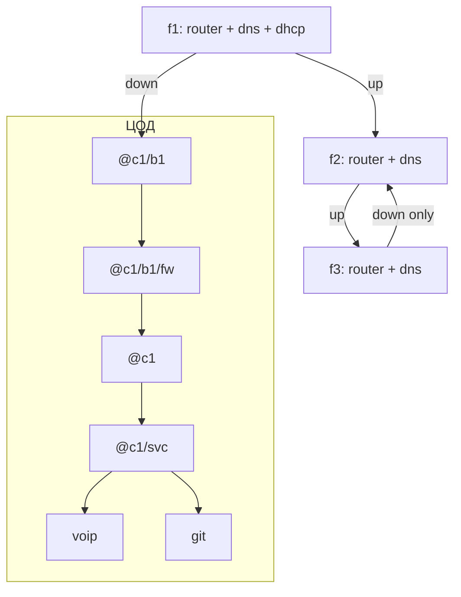

# Day-1: пошаговый walkthrough

[← 03 Алиасы](./03-aliases.md) · [Оглавление](./README.md) · [05 Lab](./05-lab-walkthrough.md)

Классический пресет: ЦОД + 3 этажа, `dns-lite`, блок-DHCP на f1, `dhdns2`.

Lab-путь — [глава 05](./05-lab-walkthrough.md).

---

## Порядок подключений: что к чему

Схема дня 1: **цепочка этажных роутеров** + money/FW в ЦОД + **DNS/DHCP на f1**, DNS на f2/f3. Номера портов — пример; **запиши свои**.

### Общая картина



Вертикальные линки = кабель в розетку + **Tower Link** в телефоне.  
FW стоит **на пути** пакетов (кабель через него), не «рядом для красоты».

---

### ЦОД — порядок патчинга

#### 0. Питание

`@c1`, `@c1/b1`, `@c1/b1/fw`, `@c1/svc`, **`@c1/dns`**, **`@c1/dhcp`**, voip, git → розетки ЦОД.  
(Плюс на этаже 1 — свои dns-lite + dnsmasq блока.)

#### 1. Ствол с firewall (оранжевый ~200)

| # | От | Port | К | Port |
|---|----|------|---|------|
| 1 | `@c1/b1` | **7** | `@c1/b1/fw` | **0** |
| 2 | `@c1/b1/fw` | **1** | `@c1` | **0** |
| 3 | `@c1` | **1** | `@c1/svc` | **7** |

#### 2. Серверы ЦОД (красный) — к `@c1` или `@c1/svc`

| # | От | Port | К | ПО |
|---|----|------|---|-----|
| 4 | `@c1` | **2** | `@c1/dns` | dns-server + padu_v1 |
| 5 | `@c1` | **3** | `@c1/dhcp` | dnsmasq |
| 6 | `@c1/svc` | **0** | `@c1/svc/voip` | voip-server |
| 7 | `@c1/svc` | **1** | `@c1/svc/git` | gitcoffee |

```text
@c1     port2/3 ──красный── @c1/dns , @c1/dhcp
@c1/svc port0/1 ──красный── voip , git
```

#### 3. Одна розетка под ствол блока

| # | Розетка ЦОД | К | Port edge |
|---|-------------|---|-----------|
| 8 | под линк с этажа 1 | `@c1/b1` | **0** |

#### 4. Debugger

Фиолетовый → свободный порт `@c1`.

#### Схема портов ЦОД (заполни)

```text
@c1/b1      0   ← TL с f1
@c1/b1      7   → FW
@c1/b1/fw   0/1 → @c1
@c1         0   ← FW
@c1         1   → @c1/svc
@c1         2   → @c1/dns
@c1         3   → @c1/dhcp
@c1/svc     7   ← @c1
@c1/svc     0/1 → voip / git
```

---

### Этаж — общий шаблон (локаль одинакова)

| # | Действие | От | К | Цвет |
|---|----------|----|---|------|
| 1 | Питание | розетка | Blade, роутер, **FW**, серверы | питание |
| 2 | Клиенты | consumer | Blade | синий |
| 3 | Phone / cam / producer | устройство | Blade | зелёный |
| 4 | Агрегация | Blade | роутер portL | **белый** |
| 5 | Down через FW | роутер portD | **FW port0** | жёлтый короткий |
| 6 | Down в riser | **FW port1** | розетка «вниз» | **жёлтый** |
| 7 | Up (не на последнем этаже) | роутер portU | розетка «вверх» | **оранжевый** |
| 8 | Tower Link | serial down/up | парная розетка | — |

```text
Клиенты/phone ──→ Blade ──белый──→ Роутер
                                    │
                         portD ──→ FW ──→ розетка DOWN → TL
                         portU ──→ розетка UP → TL   (нет на f3)
```

Ниже — **отдельные схемы** для первого этажа блока и для остальных.

---

### Схема: первый этаж блока (f1)

DNS + DHCP блока · down в ЦОД через `f1/fw` · up на f2.

```text
                    ┌──────────────────────────────────────┐
                    │               ЭТАЖ 1                 │
  клиенты ─синий─┐  │                                      │
  phone ─зелён.──┼──┤→ Blade5 ──белый──→ @c1/b1/f1          │
  producer ──────┘  │               │                      │
                    │          port2├──красный──→ @c1/b1/dns│
                    │          port3├──красный──→ @c1/b1/dhcp│
                    │          port0│ ← Blade                │
                    │          port1├──оранжевый──→ розетка UP → f2
                    │          port7├──жёлтый──→ f1/fw port0 │
                    │               │                      │
                    │          @c1/b1/f1/fw                 │
                    │            port1 ──жёлтый──→ розетка DOWN
                    └───────────────┼──────────────────────┘
                                    │ Tower Link
                                    ▼
                             ЦОД @c1/b1 port0
```

| Порт | Куда |
|------|------|
| f1 port0 | Blade |
| f1 port1 | UP → этаж 2 |
| f1 port2 | `@c1/b1/dns` |
| f1 port3 | `@c1/b1/dhcp` |
| f1 port7 → f1/fw → DOWN | TL → `@c1/b1` в ЦОД |

```text
ncall @c1/b1/f1/fw @c1/b1/dns FW1_HW
fcmal @c1/b1/f1/fw
rca @c1/b1/f1/s1 0 @c1/b1/f1
rca @c1/b1/dns 2 @c1/b1/f1
rca @c1/b1/dhcp 3 @c1/b1/f1
rcat udp/67 3 @c1/b1/f1
rcb @c1/b1/f1
rca @c1/b1/f2 1 @c1/b1/f1
rcd 7 @c1/b1/f1
pidns1 @c1/b1/dns
program start dns-lite on @c1/b1/dns
pidhcp1 @c1/b1/dhcp
program start dnsmasq on @c1/b1/dhcp
dhprefix @c1/b1/ @c1/b1/dhcp
dhcp option dns @c1/b1/dns @c1/dns on @c1/b1/dhcp
```

На edge в ЦОД: `rca @c1/b1/f1 0 @c1/b1`.  
`udp/67` с f2/f3 должен доходить до dhcp на f1 (`rcat udp/67` вниз на каждом этаже).

---

### Схема: остальные этажи блока (f2 — середина)

Свой DNS · **без** DHCP · down через `f2/fw` на f1 · up на f3.

```text
                    ┌──────────────────────────────────────┐
                    │               ЭТАЖ 2                 │
  клиенты ──────────┤→ Blade ──белый──→ @c1/b1/f2           │
                    │               │                      │
                    │          port2├──красный──→ @c1/b1/f2/dns
                    │          port0│ ← Blade                │
                    │          port1├──оранжевый──→ UP → f3  │
                    │          port7├──жёлтый──→ f2/fw       │
                    │          f2/fw ──→ DOWN → TL → UP f1   │
                    └──────────────────────────────────────┘
```

```text
ncall @c1/b1/f2/fw @c1/b1/f2/dns FW2_HW
fcmal @c1/b1/f2/fw
rca @c1/b1/f2/s1 0 @c1/b1/f2
rca @c1/b1/f2/dns 2 @c1/b1/f2
rca @c1/b1/f3 1 @c1/b1/f2
rcat udp/67 7 @c1/b1/f2
rcd 7 @c1/b1/f2
pidns1 @c1/b1/f2/dns
program start dns-lite on @c1/b1/f2/dns
dmap voip.none @c1/svc/voip @c1/b1/f2/dns
dmap git.none @c1/svc/git @c1/b1/f2/dns
```

---

### Схема: последний этаж блока (f3)

Как f2, но **нет UP** и нет DHCP.

```text
                    ┌──────────────────────────────────────┐
                    │        ЭТАЖ 3 (конец блока)          │
  клиенты ──────────┤→ Blade ──белый──→ @c1/b1/f3           │
                    │          port2 ──→ @c1/b1/f3/dns       │
                    │          port7 ──→ f3/fw ──→ DOWN → f2 │
                    │          UP: нет                       │
                    └──────────────────────────────────────┘
```

```text
ncall @c1/b1/f3/fw @c1/b1/f3/dns FW3_HW
fcmal @c1/b1/f3/fw
rca @c1/b1/f3/s1 0 @c1/b1/f3
rca @c1/b1/f3/dns 2 @c1/b1/f3
rcat udp/67 7 @c1/b1/f3
rcd 7 @c1/b1/f3
pidns1 @c1/b1/f3/dns
program start dns-lite on @c1/b1/f3/dns
dmap voip.none @c1/svc/voip @c1/b1/f3/dns
dmap git.none @c1/svc/git @c1/b1/f3/dns
```

Не линкуй f3 → этаж 4: блок `b2` со своим первым этажом (dns+dhcp+fw).

---

### Таблица Tower Link блока b1

| Линк | From | To | Зачем |
|------|------|----|-------|
| A | floor 0, serial к `@c1/b1` | floor 1, serial **после** `f1/fw` (DOWN) | ствол в ЦОД |
| B | floor 1 UP | floor 2 DOWN (после `f2/fw`) | вверх/вниз |
| C | floor 2 UP | floor 3 DOWN (после `f3/fw`) | вверх/вниз |
| — | этаж 3 вверх | — | **не создавать** |

Старт — **cat1**.

---

### Чего не делать

| Ошибка | Почему |
|--------|--------|
| Этажный FW мимо down | Вирус этажа уходит вниз без фильтра |
| Только ЦОД-FW | Зараза гуляет по цепочке этажей |
| Три линка этаж→ЦОД | Ломает блок |
| Up с f3 на этаж 4 | Склеишь b1 и b2 |
| DHCP на f2/f3 | DHCP только на f1 |
| Whitelist без tcp/23 | Datawiper |

---

### Мини-чеклист патчинга

**ЦОД**

- [ ] c1, b1, **b1/fw**, svc, voip, git  
- [ ] b1 → b1/fw → c1 → svc  
- [ ] `fcmal @c1/b1/fw` · Datawiper  

**Этаж 1**

- [ ] Blade + router + **f1/fw** + dns + dhcp  
- [ ] down: router → fw → ЦОД; up → f2  
- [ ] `fcmal @c1/b1/f1/fw`  

**Этажи 2–3**

- [ ] Blade + router + **fN/fw** + dns  
- [ ] down через fw; на f2 есть up; на f3 up нет  
- [ ] `fcmal` на каждом этажном FW  
- [ ] Link lights A/B/C  

---

---

# ЧАСТЬ I — День 1 (пошагово)

Делай строго по порядку. Не прыгай к DNS, пока не горят линки.

## Шаг 0. Осмотрись

1. Ты в **ЦОД (floor 0)** — стойки, розетки сети и питания.  
2. На телефоне открой **Surveyor** — посмотри этажи 1–3: кто consumer, кто producer, часы активности.  
3. Запиши в блокнот (или clipboard игры) serial’ы розеток riser, которые будешь использовать.

## Шаг 1. Расставь железо в ЦОД и запатчь по схеме

1. Micro `@c1`, Milli `@c1/b1`, FW `@c1/b1/fw`, Milli `@c1/svc`.  
2. Boulder+: **`@c1/dns`**, **`@c1/dhcp`**, voip, git.  
3. Питание; оранжевый ствол; красный к dns/dhcp/voip/git.  
4. Розетка под down с f1; debugger; Datawiper.  

Этажи — шаг 7–8.

## Шаг 2. Открой netshell и заведи алиасы

1. Debugger в сети → открой терминал / netshell.  
2. Узнай hardware id debugger’а (число на устройстве / в UI).  
3. Выполни (подставь число):

```text
always using 12345
```

или после создания алиасов: `setdbg 12345`.

4. Скопируй нужные секции из [`alias-pack.txt`](./alias-pack.txt) или см. [главу про алиасы](./03-aliases.md).

## Шаг 3. Имена в ЦОД (DNS = `@c1/dns`)

```text
ncall @c1 @c1/dns HW
ncall @c1/b1 @c1/dns HW
ncall @c1/b1/fw @c1/dns HW
ncall @c1/svc @c1/dns HW
ncall @c1/dns @c1/dns HW_DNS
ncall @c1/dhcp @c1/dns HW_DHCP
ncall @c1/svc/voip @c1/dns HW
ncall @c1/svc/git @c1/dns HW
```

## Шаг 4. Программы в ЦОД

```text
pip1 @c1/dns
pidns2 @c1/dns
program start padu_v1 on @c1/dns
program start dns-server on @c1/dns
pidhcp1 @c1/dhcp
program start dnsmasq on @c1/dhcp
dhprefix @c1/ @c1/dhcp
dhdns @c1/dns @c1/dhcp
pivoip @c1/svc/voip
pigitc @c1/svc/git
program start voip-server on @c1/svc/voip
program start gitcoffee on @c1/svc/git
```

`dns-server` **без** running `padu_v1` не кормится store-text — проверь `program view running on @c1/dns`.

## Шаг 5. Маршруты в ЦОД

```text
rca @c1/b1 0 @c1
rca @c1/svc 1 @c1
rca @c1/dns 2 @c1
rca @c1/dhcp 3 @c1
rca @c1 7 @c1/b1
rcd 7 @c1/b1
rca @c1 7 @c1/svc
rcd 7 @c1/svc
rca @c1/svc/voip 0 @c1/svc
rca @c1/svc/git 1 @c1/svc
rcat udp/67 3 @c1
```

После линка с f1: `rca @c1/b1/f1 0 @c1/b1`.

## Шаг 5b. Firewall против Morris (не откладывай на неделю)

Железо уже в разрыве b1→c1. Без правил FW ≈ прозрачный — **вирус проходит**.

1. Имя уже есть: `ncall @c1/b1/fw …` (шаг 3).  
2. **Сначала мягкий режим** (default allow + deny мусора) — почти не ломает выручку:

```text
fcmal @c1/b1/fw
fsh @c1/b1/fw
```

Режет scraper `tcp/8034` и Morris `tcp/510–519`.

3. Когда `ping`/`trace`/деньги стабильны — можно ужесточить whitelist:

```text
fcsafe @c1/b1/fw
```

или `fcall` (то же по сути). **tcp/23 всегда первым в allow**, иначе Datawiper.

4. Проверка после правил: `ping @c1/b1/f1` с ядра, `trc @c1/svc/voip from @c1/b1/f1/c1`, управление netshell на FW живо.

5. Если отрезал себя → Datawiper USB на FW = factory reset → снова с `fcmal`.

Костыль без железа FW (хуже): blackhole на edge `rcbh tcp/8034 EMPTY_PORT @c1/b1` (+ пачка на 510–519) — не замена нормальному FW.

Позже: второй FW перед `@c1/svc` тем же рецептом.

## Шаг 6. Registry (деньги)

1. Rocket Store → **The Registry**.  
2. Домен `voip.none` → usage **STREAM-VOICE** → PPU **~1.1**.  
3. Домен `git.none` → usage **UPDATE-SOFTWARE** → PPU **~1.1**.  
4. В netshell на **каждом** DNS этажа:

```text
dmap voip.none @c1/svc/voip @c1/dns
dmap git.none @c1/svc/git @c1/dns
dmap voip.none @c1/svc/voip @c1/b1/dns
dmap git.none @c1/svc/git @c1/b1/dns
dmap voip.none @c1/svc/voip @c1/b1/f2/dns
dmap git.none @c1/svc/git @c1/b1/f2/dns
dmap voip.none @c1/svc/voip @c1/b1/f3/dns
dmap git.none @c1/svc/git @c1/b1/f3/dns
```

Money **обязательно** на `@c1/dns`. На DNS блока/этажа — дубль map **или** клиенты возьмут второй DNS из DHCP (`@c1/dns`).

## Шаг 7. Этаж 1 — роутер + FW + DNS + DHCP

Полная схема: [первый этаж блока](#схема-первый-этаж-блока-f1).

1. Blade + `@c1/b1/f1` + **`@c1/b1/f1/fw`** + dns + dhcp, питание.  
2. Клиенты → Blade → роутер; красный → dns/dhcp.  
3. Down: роутер → **f1/fw** → розетка → TL в ЦОД; up → f2.  
4. Имена / программы / `fcmal`:

```text
ncall @c1/b1/f1 @c1/b1/dns ROUTER_HW
ncall @c1/b1/f1/fw @c1/b1/dns FW1_HW
ncall @c1/b1/dns @c1/b1/dns DNS_HW
ncall @c1/b1/dhcp @c1/b1/dns DHCP_HW
ncall @c1/b1/f1/s1 @c1/b1/dns SWITCH_HW
fcmal @c1/b1/f1/fw
pidns1 @c1/b1/dns
program start dns-lite on @c1/b1/dns
pidhcp1 @c1/b1/dhcp
program start dnsmasq on @c1/b1/dhcp
dhprefix @c1/b1/ @c1/b1/dhcp
dhdns2 @c1/b1/dns @c1/dns @c1/b1/dhcp
```

`dhdns2` = два DNS: сначала блок, потом корень ЦОД (если алиаса нет: `dhcp option dns @c1/b1/dns @c1/dns on @c1/b1/dhcp`).

5. Маршруты — как в схеме f1.  
6. `dmap` money на `@c1/b1/dns`.  
7. `ping @c1/b1/dns` · `dhs @c1/b1/dhcp` · `fsh @c1/b1/f1/fw`.

## Шаг 8. Этажи 2 и 3 — роутер + FW + DNS (без DHCP)

Схемы: [f2](#схема-остальные-этажи-блока-f2--середина), [f3](#схема-последний-этаж-блока-f3).

**Этаж 2:** Blade + f2 + **f2/fw** + f2/dns; down через fw на f1; up на f3.

```text
ncall @c1/b1/f2 @c1/b1/f2/dns R2_HW
ncall @c1/b1/f2/fw @c1/b1/f2/dns FW2_HW
ncall @c1/b1/f2/dns @c1/b1/f2/dns DNS2_HW
fcmal @c1/b1/f2/fw
pidns1 @c1/b1/f2/dns
program start dns-lite on @c1/b1/f2/dns
dmap voip.none @c1/svc/voip @c1/b1/f2/dns
dmap git.none @c1/svc/git @c1/b1/f2/dns
rcat udp/67 7 @c1/b1/f2
```

**Этаж 3:** то же с `f3` / **dns-lite** / `f3/fw`, только down.

Клиенты f2/f3: адрес с DHCP f1; DNS — option `@c1/b1/dns` или `ncall` на `@c1/b1/fN/dns`.

## Шаг 9. Телефон (VOIP-выручка)

1. Телефон → Blade (зелёный) → уже в этажном роутере.  
2. `ncall @c1/b1/f2/phone @c1/b1/dns HW`.  
3. Traffic к VOIP вверх по цепочке / default:

```text
rcat udp/5060 7 @c1/b1/f2
rcat udp/5060 7 @c1/b1/f1
rcat udp/5060 0 @c1/b1
rcat udp/5060 PORT_VOIP @c1/svc
```

(или опирайся на default down, если он уже ведёт в ЦОД — проверь `trace`.)  
4. `watch @c1/svc/voip`.

## Шаг 10. День 1 готов, если

- [ ] ЦОД: edge + fw + svc + **@c1/dns + @c1/dhcp** + voip/git  
- [ ] f1: router + fw + **dns-lite + dnsmasq** (dns option: блок + `@c1/dns`)  
- [ ] f2/f3: router + fw + **dns-lite**  
- [ ] `program start` на dns/dhcp/voip/git; padu running с dns-server  
- [ ] `fcmal` на всех FW  
- [ ] dmap money на `@c1/dns` (+ дубли на этажах по желанию)   

**Не делай:** up f3→4; FW мимо down; DHCP на f2/f3; whitelist без tcp/23.

---
