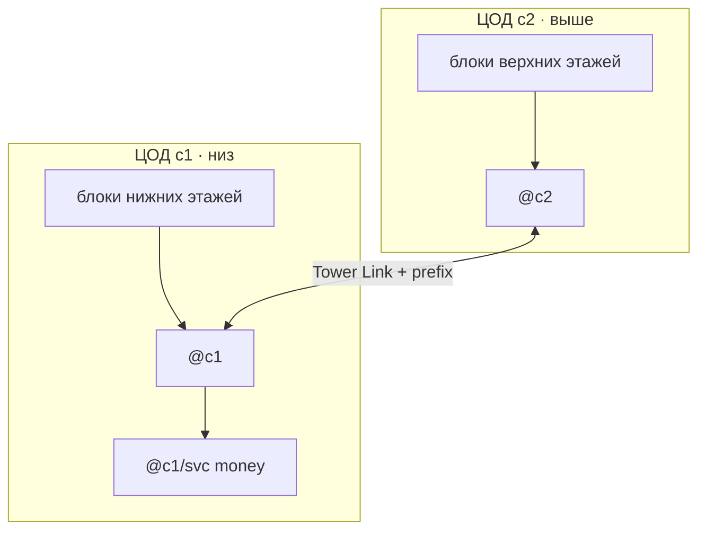

# Масштабирование и расширение

[← 05 Lab](./05-lab-walkthrough.md) · [Оглавление](./README.md) · [07 Справочник](./07-advanced-reference.md)

Продолжение Day-1: блоки, FW, бэкапы, второй ЦОД.

---

# ЧАСТЬ II — Расширение (что зачем)

Ниже — **по пунктам**: зачем нужно → когда брать → что купить → как настроить → алиасы.  
Деньги и **базовый FW (`fcmal`)** — в части I. Дальше: жёсткий whitelist, бэкапы, DHCP, рост.

## Обзор приоритетов

| Порядок | Тема | Зачем | Unlock / цена (ориентир) |
|---------|------|-------|---------------------------|
| 0 | **FW блока (`fcmal`)** | Morris — уже в дне 1 | Железо FW + Datawiper |
| 1 | Блок b2 | Своя цепочка + DNS/DHCP на своём f1 | Магазин |
| 2 | FW whitelist / FW перед svc | Жёстче политика | `fcsafe` / второй FW |
| 3 | Тонкая настройка DHCP binds | Продюсеры всегда с тем же `@` | уже на f1 |
| 4 | **Remote Backups** (`sftp`) | Конфиги после warranty | Secretariat **~450$** |
| 5 | **Jailbreaker** | Достать ПО с железа (FW→сервер и т.п.) | Secretariat **~1000$** (часто нужен sftp) |
| 6 | Socketeer | Розетки где удобно | Rocket Store **~500$** |
| 7 | VLAN | Разделить phone/cam/клиентов на одном uplink | Managed switch |
| 8 | RIP | Не писать mid-hop routes руками | Secretariat **~1500$** |
| 9 | Padu / больше money | Больше usage | padu_v1/v2/v3 |
| 10 | Второй ЦОД | Место + короче путь наверх | New Data Center (**+10% admin**) |
| 11 | Cablers Union | Дешевле кабели / makers | Secretariat |
| 12 | VM / HA / NetOps | Поздняя оптимизация | Research proposals |

---

## 1. Новый блок `b2` (этажи 4–6)

### Зачем
Один edge на 6+ этажей = перегруз ПС и единая точка отказа. Блок изолирует сбой: умер `b2` — `b1` и money живы.

### Почему может потребоваться
Появились этажи 4+. View Links краснеет. Клиенты тормозят.

### Куда ставить серверы блока b2

| Роль | Где |
|------|-----|
| Edge `@c1/b2` + FW | ЦОД (или хаб) |
| **DNS + DHCP** | **Первый этаж b2** (башня 4): `@c1/b2/dns`, `@c1/b2/dhcp` |
| DNS | Этажи 5 и 6: `@c1/b2/f2/dns`, `@c1/b2/f3/dns` |
| Money | Остаётся `@c1/svc` |

Не линкуй up с `@c1/b1/f3` на этаж 4.

### Что купить
- Milli `@c1/b2` + FW  
- На этаже 4: роутер + Blade + DNS + DHCP  
- На 5 и 6: роутер + Blade + DNS  
- Цепочка TL + ствол в ЦОД  

### Настройка

```text
ncall @c1/b2 @c1/b2/dns EDGE_HW
rca @c1/b2 PORT @c1
rca @c1/b2/f1 0 @c1/b2
dhprefix @c1/b2/ @c1/b2/dhcp
dhdns @c1/b2/dns @c1/b2/dhcp
dmap voip.none @c1/svc/voip @c1/b2/dns
```

Дальше — цепочка f1↔f2↔f3 внутри b2; DHCP только на f1.

---

## 2. Firewall (углубление)

Базовый `@c1/b1/fw` + `fcmal` уже в **части I**. Здесь — ужесточение и второй контур.

### Зачем ещё
Whitelist вместо «всё кроме Morris»; отдельный FW перед money, чтобы заражённый блок не стучался в voip/git лишним.

### Что купить
Второй FW → `@c1/svc/fw` в разрыв `c1` → `svc` (или `svc` → серверы). Datawiper уже должен быть.

### Настройка
На блочном FW, когда стабильно: `fcsafe @c1/b1/fw`.  
На money: `fcsafe @c1/svc/fw` или `fcall`.  
Клон правил после sftp: `cpfw @c1/b1/fw @c1/svc/fw`.

Симптомы Morris: роутер «тупит», ПС проседает, в `program list` / `sftp ls` появляется morris. **Отрежь uplink блока** от ядра → чисти → только потом возвращай линк.

---

### DHCP блока (f1)

```text
dhprefix @c1/b1/ @c1/b1/dhcp
dhcp option dns @c1/b1/dns @c1/dns on @c1/b1/dhcp
dhbind PRODUCER_HW @c1/b1/f2/p1 @c1/b1/dhcp
rcat udp/67 3 @c1/b1/f1
rcat udp/67 7 @c1/b1/f2
rcat udp/67 7 @c1/b1/f3
```

Второй DNS `@c1/dns` — корень ЦОД (money / имена ядра), если блок перегружен.

### DHCP ЦОД

```text
dhprefix @c1/ @c1/dhcp
dhdns @c1/dns @c1/dhcp
```

Раздаёт имена железу ЦОД (`@c1/…`). Авто-DNS доменов Registry всё равно нет — `dmap` на `@c1/dns`.

---

## 4. Remote Backups (`sftp`) — обязательно для долгой башни

### Зачем
После **warranty** железо дохнет. Routes, firewall rules, программы живут на устройстве. Без бэкапа = настройка с нуля.

### Почему может потребоваться
Любой edge/ядро/DNS с конфигом. Особенно после первого «умер роутер».

### Unlock
Secretariat → **Remote Backups** (~450$, «3-2-1 let's back it up!») → команда `sftp`.

### Что купить
Устройство со **свободным storage** (NAS / запасной Boulder) → `@nas`.

### Настройка

```text
sfls @c1/b1
bkroutes @c1/b1 @nas
bkfw @c1/b1/fw @nas
```

Восстановление: `sftp cp` **с NAS на** новое железо с тем же `@`, потом те же кабели/порты.

Когда откроют **cron** + `try`:

```text
crdr routes @c1/b1 @nas
crping @c1
```

---

## 5. Jailbreaker (не забудь)

### Зачем
**Достать программы/прошивки с железа** и поставить на другое устройство. Примеры из сообщества:

- скопировать firewall-софт на обычный сервер (software-firewall);  
- переносить бинарники/конфиги между коробками вместе с sftp;  
- гибче кастомить, чем «только магазинный FW».

Без Jailbreak’а sftp часто копирует конфиги, но **извлекать и ставить «железные» программы** куда угодно — ограничено.

### Почему может потребоваться
Хочешь FW-логику на сервере; мало слотов под железные firewall; эксперименты с routing-firewall; копирование ПО после аварии.

### Unlock
Secretariat → **Jailbreaker** (~1000$, «Hardware Liberation Day»).  
В гайдах часто пишут: **сначала Remote Backups / sftp**, потом Jailbreak (или оба).

### Как пользоваться (общая схема)

1. Unlock Jailbreaker + рабочий `sftp`.  
2. `sftp ls on @firewall` — смотри `/bin/`, конфиги (`/etc/nftables.conf` и т.п.).  
3. Копируй нужные файлы на сервер с storage.  
4. На целевом устройстве — install/запуск по man текущей сборки (интерфейс ещё развивается).  
5. Не забудь allow’ы и tcp/23, если крутишь FW-правила на новом хосте.

```text
sfls @c1/b1/fw
sfcp /etc/nftables.conf @c1/b1/fw @nas /backups/fw/nftables.conf
cpfw @c1/b1/fw @spare_fw
```

Точные пути бинарников смотри `sftp ls` и `man` у себя — сборки отличаются.

### Связка sftp + Jailbreak + Morris

Чистка роутера после Morris часто: `sftp rm /bin/morris…` (`morrt`). Без sftp — боль. Jailbreak расширяет, что можно снимать/переносить с железа.

---

## 6. GitCoffee + Padu (money глубже)

### Зачем
`git.none` (UPDATE-SOFTWARE) + Padu (Store-Text и связки) — стабильный доход наряду с VOIP.

### Почему может потребоваться
Только VOIP мало; Surveyor показывает спрос на updates/store.

### Настройка

```text
pigitc @c1/svc/git
pip1 @c1/svc/git
pip1 @c1/svc/padu
dmap git.none @c1/svc/git @c1/b1/dns
rcat tcp/443 PORT_GIT @c1/svc
rcat tcp/80 PORT_PADU @c1/svc
```

Registry: git → UPDATE-SOFTWARE PPU ~1.1; store-домены → Store-Text ~1.1.  
Позже Secretariat: padu_v2/v3, poems-db.

---

## 7. Socketeer

### Зачем
Дополнительные **розетки** copper/fiber/power в мире — не тянуть кабель через весь ЦОД.

### Почему
Закончились порты на стене; второй ряд стоек; новый ЦОД.

### Как
Rocket Store → Socketeer (~500$) → place socket → pay. Remove — тоже платно.

---

## 8. VLAN

### Зачем
При **конечной ПС** switch ≈ хаб: телефоны, камеры и клиенты мешают друг другу. VLAN режет broadcast-домены на одном физическом uplink’е.

### Почему может потребоваться
Uplink этажа забит; udp/5060 и udp/554 тонут в клиентском шуме; хочешь phone «ближе» к VOIP.

### Что купить
Managed switch с VLAN (Blade12/15/88… — смотри фичи). Иногда VLAN-роутер (router-on-a-stick).

### Настройка (идея)

```text
vshow @c1/b1/f1/s1
vtag1 2 10 @c1/b1/f1/s1
vlan tag port0 with #10 #20 on @c1/b1/f1/s1
```

На роутере — subinterface `port0.1` с тем же tag и `rca` на префикс VLAN.  
Новичку: **сначала блоки без VLAN**; VLAN — когда упёрся в ПС.

---

## 9. RIP

### Зачем
Автораздача маршрутов между роутерами. Ты пишешь только endpoint’ы; середина подхватывается.

### Unlock
Secretariat → Route Discovery / RIP (~1500$).

```text
ripup @c1
ripup @c1/b1
ripup @c1/svc
ripsh @c1
```

Endpoint’ы (`rca` на voip/git) всё равно нужны.

---

## 10. Второй ЦОД

### Зачем
Место под стойки; edge верхних блоков ближе к этажам; разгрузка линков в подвал.

### Unlock
**New Data Center** — бесплатно, но **admin fees +10%**.

### Как
Ядро `@c2`, блоки `@c2/b1…`, Tower Link c2↔c1, money оставь на `@c1/svc`. Подробно: [`07-advanced-reference.md`](./07-advanced-reference.md) → [Несколько ЦОД](./02-network-fundamentals.md#несколько-цод-второй-и-дальше).

---

## 11. Tower Link апгрейд / ПС

### Зачем
cat1 ≈ 15 traversals/tick. Много этажей → 100% в View Links.

### Как
View Links → Manage → deactivate → upgrade (cat5 / fiber…) → reactivate. Краткий outage.  
Лечение роста: блоки + толще ствол + второй ЦОД, не «все на один Blade».

---

## 12. Прочее (кратко)

| Тема | Зачем | Когда |
|------|-------|--------|
| **Cablers Union** | −30% кабели, потом cable makers | Много закупок Ethernet |
| **Power Management** | Счета за свет, wake/suspend NAS | После Remote Backups / cron |
| **VM Research** | Несколько ролей на одном сервере | Мало места в стойке |
| **HA Research** | Отказоустойчивость роутеров | Поздняя игра |
| **pcap / tap** | Диагностика перегруза | Красные линки без причины |
| **Blackhole route** | Глушить scraper без FW | Быстрый костыль: `rcbh tcp/8034 EMPTY_PORT @edge` |
| **Decentro** | crypto tcp/8333 | Отдельный money-stream |
| **Botnet / UBBT** | Подмена/раздувание трафика | Поздний/опциональный контент |

---

---

## DHCP в блоке (режим B)

1. `program install dnsmasq` (или kea) on `@c1/bN/dhcp`.  
2. `dhcp option prefix @c1/bN/ on @c1/bN/dhcp`  
3. `dhcp option dns @c1/bN/dns on @c1/bN/dhcp`  
4. `dhcp option bind` для продюсеров / DNS.  
5. `rcat udp/67 …` на edge к DHCP.  
6. Авто-DNS всё равно **выкл** — домены money map-ишь руками на DNS блока.

---

---

## Несколько ЦОД (второй и дальше)

Да, **ЦОД в башне может быть несколько**. Это не «ещё один этаж с Blade», а отдельный датацентровый этаж с местом под стойки, без лимита мощности как у жилых этажей.

### Как появляется

В Secretariat proposal **New Data Center**:

| | |
|--|--|
| Цена | **Бесплатно**, но **admin fees +10%** (каждый новый ЦОД снова жмёт админку) |
| Эффект | На **следующем** этаже появляется **новый, обычно более просторный** ЦОД |

Бери второй ЦОД, когда: порты/место в подвале кончились, верхние блоки далеко тянуть в floor 0, или хочешь разнести money и edge по этажам. Не бери «на всякий» — +10% админки навсегда для этого run.

### Как вписать в схему имён

Не ломай уже работающий `@c1`. Новый ЦОД = новый префикс ядра:

```text
@c1              первый ЦОД (ядро / money — как было)
@c1/svc          money-сервисы — лучше оставить здесь, пока не вынужден переезжать
@c1/b1…bN        блоки, которые физически сидят в c1 или ходят в c1

@c2              ядро второго ЦОД
@c2/b1 …         блоки верхних этажей, edge которых стоит уже в c2
```

Связка ЦОД↔ЦОД: Tower Link между розетками двух DC-этажей + `rca @c2 PORT @c1` и обратно (или RIP, когда откроешь). Один prefix-route на соседнее ядро — как между блоками.



### Что делать практически, когда вырос второй ЦОД

1. **Не переезжай** VOIP/Git/DNS ядра в новый ЦОД в первый же день — оставь money на `@c1/svc`, иначе перепропишешь полбашни DNS map.  
2. Новый ЦОД используй как **площадку для edge новых блоков** (`@c2/b1`…): ближе к верхним этажам → короче riser, меньше нагрузка на линки в подвал.  
3. На `@c1`: route `@c2` → порт линка в c2. На `@c2`: default/prefix в `@c1` (чтобы клиенты верхних блоков доходили до money).  
4. DNS блоков в c2 по-прежнему map’ят `voip.none` → `@c1/svc/voip` (адрес сервиса не меняется).  
5. Питание и FW: каждый ЦОД — своя цепь; FW на стыке c2→c1 по желанию (как блок→ядро).  
6. Третий ЦОД (`@c3`) — тот же шаблон. Документируй: какой DC-этаж = какой `@cN`, какой порт = линк между ними.

> **Ошибка.** Свалить все этажи 1…N по-прежнему в один `@c1/b1` и «просто добавить комнату ЦОД» — не лечит ПС. Новый ЦОД помогает, только если **переносишь туда edge/трафик верхних блоков**, а не копируешь хаос.

---

---

## Когда этажей станет много — да, упрёшься в ПС

При твоей настройке **«бесконечная ПС устройств = Выкл»** рост башни почти всегда упирается не в «некуда воткнуть кабель», а в **конечную пропускную способность**. Симптомы: красные Tower Link ~100% traversals, клиенты «тормозят», Blade «задыхается», SLA краснеет, хотя `ping` иногда ещё ходит.

### Где именно кончается полоса

| Узкое место | Почему |
|-------------|--------|
| **Tower Link** (этаж↔ЦОД, ЦОД↔ЦОД) | Жёсткий лимит traversals/tick: cat1 ≈ 15, cat5 ≈ 30, cat5e ≈ 45; fiber выше (OM2/OM4/OM5). Дневка растёт с этажом и классом |
| **Switch ≈ хаб** | Весь broadcast/трафик этажа ест ПС Blade; 6 этажей на один слабый Blade — плохо |
| **Один edge на слишком много этажей** | Все uplink’и + DNS/DHCP блока бьют в одни порты Milli |
| **Один путь в money** | Весь VOIP/Git башни через один тонкий линк в `@c1/svc` |
| **Morris / scraper** | Червь жрёт traversal bandwidth железа; мусорный трафик забивает линки |

### Что делать по мере роста (чеклист масштаба)

1. **Блоки по ~3 этажа** — не вешай этаж 10 на тот же `@c1/b1`, что и этаж 1. Новый блок = новый edge + свой DNS/DHCP.  
2. **Смотри View Links** — average traversals ~100% → апгрейд cat (deactivate → upgrade → reactivate; краткий outage). Не стартуй сразу OM5 на этаж 1: деньги и дневка.  
3. **Второй ЦОД выше** — edge верхних блоков в `@c2`, линк c2↔c1 толще, чем десяток тонких линков каждого этажа в подвал.  
4. **Толще только «ствол»** — линк блок→ядро и ядро→svc важнее, чем патч клиент→switch.  
5. **Не один Blade на всё** — на этаже свой switch; при давлении — Blade помощнее / VLAN (phone+cam отдельно).  
6. **Режь мусор рано** — `fcmal` / `fcsafe` на uplink блока; blackhole scraper. Меньше мусора = больше ПС для денег.  
7. **Диагностика** — tap + `pcap` / `pcape`, `dstat`, `watch` на сервере (глава pcap ниже).  
8. **Не экономь на warranty** критичных edge/ядра — при конечной ПС мёртвый роутер = весь блок offline.

Грубое правило: **много этажей без блоков и без апгрейда Tower Link = гарантированный перегруз**. Блоки режут blast radius и число хостов на один роутер; апгрейд линка и второй ЦОД режут уже физическую ПС на стволе.

---
